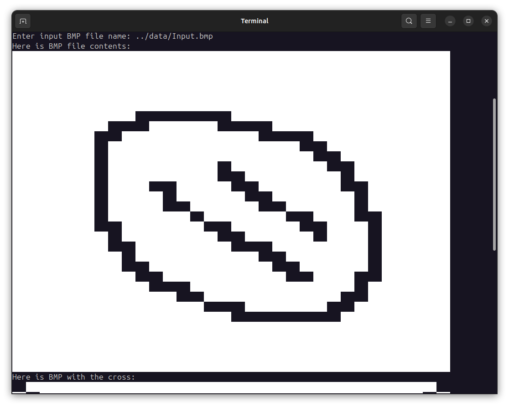
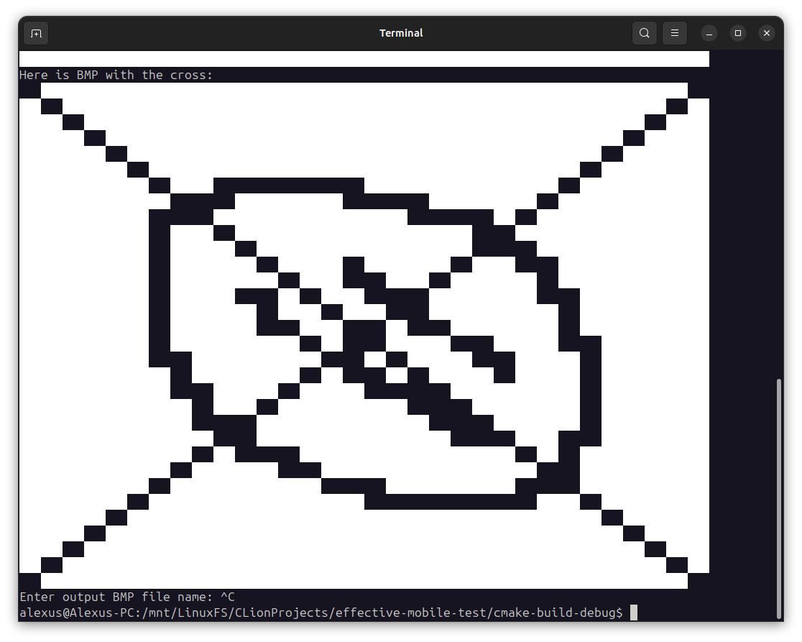
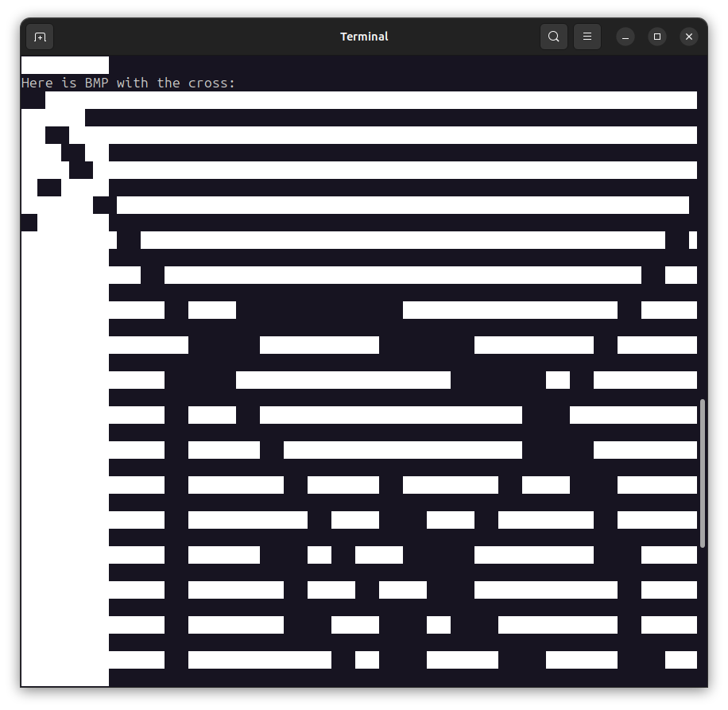

# О репозитории
Тестовое задание от компании effective mobile. Задание выполнено на языке C++20 для 
операционной системы Linux. Информация о структуре BMP-файла была взята из статьи на 
[Википедии](https://ru.wikipedia.org/wiki/BMP). Тестовая программа использует 24-х битный 
формат представления цветов.

В директории data расположены несколько BMP-файлов. 

* [Input.bmp](data/Input.bmp) входной файл размером 32х32 пикселя.
* [Input40x32.bmp](data/Input40x32.bmp) входной файл размером 40х32 пикселя.
* [Output.bmp](data/Output.bmp) выходной файл размером 32х32 пикселя с двумя пересекающимися линиями.
* [Output40x32.bmp](data/Output40x32.bmp) выходной файл размером 40х32 пикселя с двумя пересекающимися линиями.
* [stdin_redir.txt](data/stdin_redir.txt) файл для редиректа инпута данных в stdin (для отладки в CLion).

В качестве алгоритма для рисования линий был использован [Алгоритм DDA-линии](https://ru.wikipedia.org/wiki/%D0%90%D0%BB%D0%B3%D0%BE%D1%80%D0%B8%D1%82%D0%BC_DDA-%D0%BB%D0%B8%D0%BD%D0%B8%D0%B8).
# Скриншоты

Содержимое исходного файла Input.bmp, выведенное в терминал.


Результат рисования линий, выведенный в терминал, а также сохранённый как Output.bmp.

> **ВАЖНО!**
> 
> Убедитесь, что размер вьюпорта терминала достаточно большой, чтобы вместить картинку, иначе возможны подобные искажения:
> 
> 

# Сборка и запуск

Для компиляции и запуска тестового приложения понадобится Cmake, g++ и Ninja.

Подготовка файлов сборки:
```shell
cmake -B build -G Ninja
```

Сборка проекта:
```shell
cmake --build build/ --target effective_mobile_test
```

Запуск приложения:
```shell
./build/effective_mobile_test
```